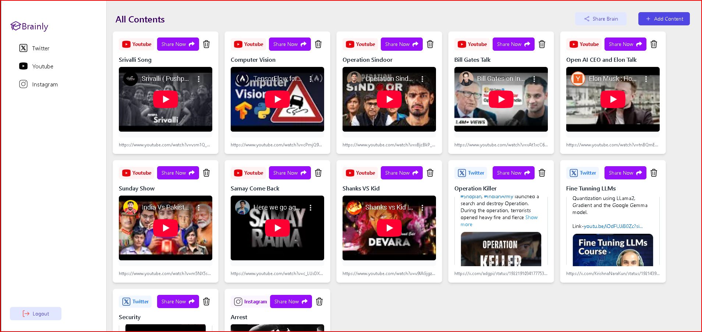
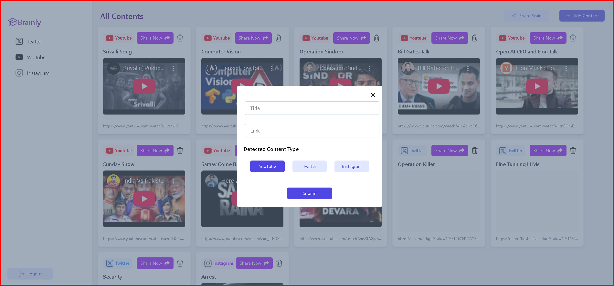

# Second Brain

A full-stack web application that helps users organize and manage content from various platforms in one centralized dashboard.

## Features

- **User Authentication**: Secure signup and login functionality with JWT
- **Content Dashboard**: View all saved content in a unified interface
- **Content Management**: Add, view, and delete content cards
- **Content Filtering**: Filter content based on source type (Twitter, YouTube, Instagram, etc.)
- **Share Functionality**: Share your Second Brain collection with others

## Screenshots

### Authentication Pages

#### Signup Page

*Create a new account with username and password*

#### Login Page

*Sign in to your existing account*

### Content Management

#### All Contents Dashboard

*View all your saved content across platforms*

#### Filter Contents View

*Filter and view Twitter-specific content*

#### Share Content

*Share the generated content via whatsapp, messenger, twitter, linkedin*

#### Adding New Content

*Modal for adding new content with URL and content type selection*

## Tech Stack

- **Frontend**: React with TypeScript
- **Styling**: Tailwind CSS
- **Backend**: Express.js with TypeScript
- **Database**: MongoDB
- **Authentication**: JWT (JSON Web Tokens)

## Usage

1. Register a new account or login with existing credentials
2. Browse your saved content or add new content using the "Add Content" button
3. Filter content by platform using the sidebar navigation
4. Share your curated content collection with others using the "Share Brain" button

## License

This project is licensed under the MIT License - see the LICENSE file for details.